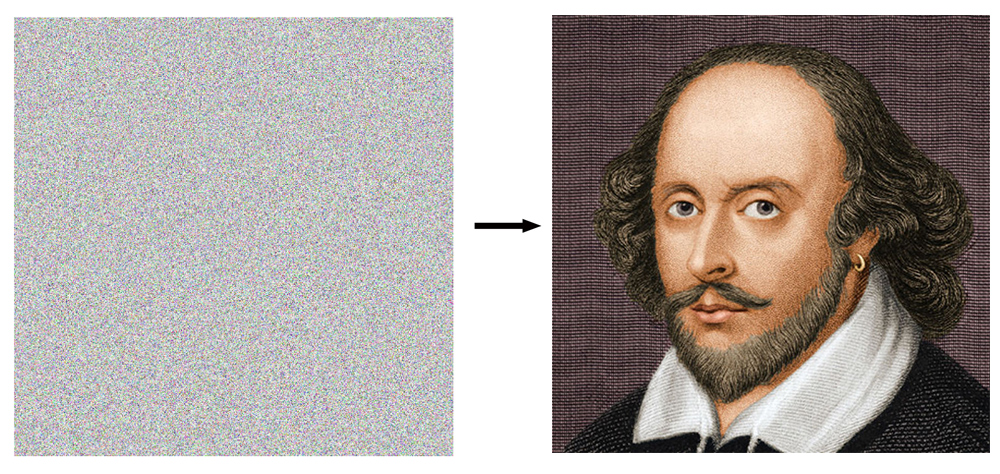

# Genetic Algorithms: Evolving Shakespeare with pixels

This in an attempt to recreate the Genetic Algorithm [Evolving Shakespeare example](https://github.com/shiffman/The-Nature-of-Code-Examples-p5.js/blob/master/chp09_ga/NOC_9_01_GA_Shakespeare/sketch.js), but instead of using a set of chars as the target, it <i>naively</i> attempts to match the arrays of pixels in the given image.

Issues
------
A small image of 40x40 pixels has an array length of 6400 elements using a pixel density of 1. This current approach will never arrive to the solution (lesson learned the hard way!). The fittest gene got only to a 0.09% fitness rate. Large populations can increase the fitness but will slow down the whole process. A couple of works around can be to use simpler black/white images, use only one channel in the RGB spectrum or create much more smaller images.

Using this image (30x30)  on one channel I got better results after several generations.

A better approach would be to consider [Simulated annealing](https://en.wikipedia.org/wiki/Simulated_annealing) technique
to simplify the size of the array to match. By overlapping polygons of various colors and transparencies insted of using all the pixels. This types of techniques to solve a similar problem can be found [here](http://alteredqualia.com/visualization/evolve/) and [here](https://rogerjohansson.blog/2008/12/07/genetic-programming-evolution-of-mona-lisa/). Although to get a good results using this approach it can take [(as describe here)](http://alteredqualia.com/visualization/evolve/):
  - 1,000 polygons (12-vertex)
  - ~7 days
  - 21,135 benefitial mutations
  - 8,143,969 candidates
  - 97.12% fitness
