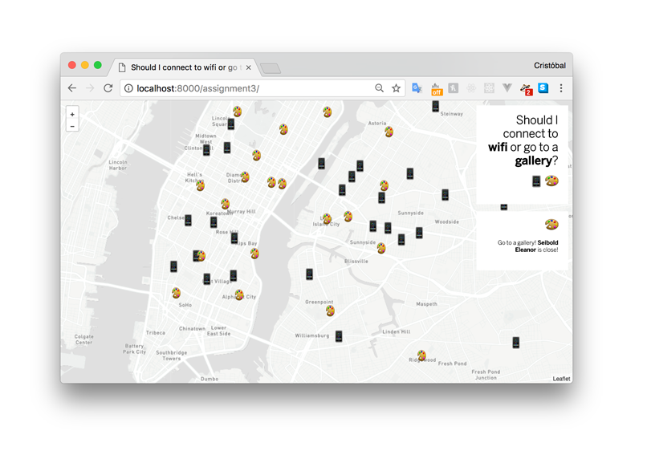

# Should I connect to wifi or go to a gallery?

Using a KNN algorithm this page tells you based on where you click on the screen, if you should go see an art gallery or connect to wifi. To do so, it searches for the K1 nearest neighbor of the position you selected and returns either a NYC art gallery or a wifi hotspot.

It uses an Euclidean distance to get the distance from the current mouse position to all the points in the dataset.

I'm using part of the [NOC KNN p5js demo](https://github.com/shiffman/NOC-S17-2-Intelligence-Learning/tree/master/week3-classification-regression/04_kNN_demo_p5).

Demo
------
[Demo](https://cvalenzuela.github.io/NOC_Intelligence-Learning/assignment3/index.html)

Data
------
Both dataset where taken from NYC Open Data Portal as GeoJSON files.

 - [New York City Art Galleries](https://data.cityofnewyork.us/Recreation/New-York-City-Art-Galleries/tgyc-r5jh)
 - [NYC Wifi Hotspot Locatios](https://data.cityofnewyork.us/Social-Services/NYC-Wi-Fi-Hotspot-Locations/a9we-mtpn)

I used [this](https://github.com/mapbox/geojson-merge) to merge both Geojson files.
